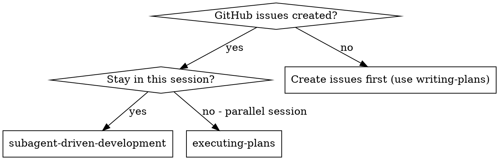
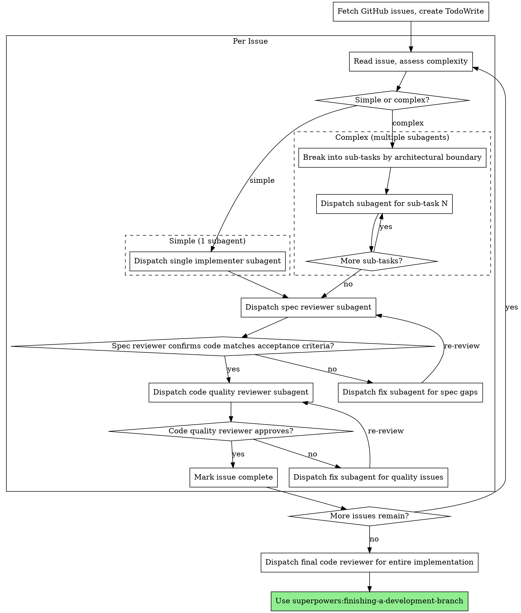

# Subagent-Driven Development

Execute plan by dispatching implementer subagents per GitHub issue, with two-stage review after each: spec compliance review first, then code quality review.

**Core principle:** Issues scoped by functionality + adaptive subagent count + two-stage review = high quality, right-sized effort

## How It Works

GitHub Issues are the unit of work, scoped by **functionality** (not by subagent capacity). After reading each issue, this skill assesses its complexity and decides whether one subagent can handle it or whether it should be broken into sequential sub-tasks with a fresh subagent per sub-task.

- **Simple issue** (bug fix, small feature): 1 implementer subagent, follows TDD internally
- **Complex issue** (spans multiple layers, many acceptance criteria): break into sub-tasks by architectural boundary, 1 subagent per sub-task, sequential execution

The two-stage review (spec compliance → code quality) runs once per issue after all sub-tasks are complete — not after each sub-task.

## When to Use



**vs. Executing Plans (parallel session):**
- Same session (no context switch)
- Fresh subagent per issue or sub-task (no context pollution)
- Two-stage review after each issue: spec compliance first, then code quality
- Faster iteration (no human-in-loop between issues)

## The Process



## Setup

1. Fetch all open issues for implementation: `gh issue list --label <label> --state open --json number,title,body` — the label was set by the writing-plans skill when creating issues (e.g., `offline-caching`). If you don't know the label, ask the user or check recently created issues.
2. Order by dependency (if noted in issue bodies), otherwise by issue number
3. Create TodoWrite with one entry per issue

## Per Issue

### Step 1: Read and Assess Complexity

Read the issue via `gh issue view <number> --json title,body`. Then assess:

**Use 1 subagent when:**
- The issue has a small number of acceptance criteria (roughly 1-4)
- The work touches one architectural layer (e.g., just the data layer, or just the UI)
- A single subagent could reasonably hold all the relevant files and context

**Break into sub-tasks (multiple subagents) when:**
- The issue spans multiple architectural layers (data + business logic + UI)
- The acceptance criteria cover distinct, separable concerns
- Implementing everything at once would require a subagent to hold too many files in context

**When in doubt, start with 1 subagent.** You can always dispatch a second if the first runs into context limits or the implementation is clearly too large for one pass. Over-splitting wastes more time than under-splitting.

**How to break into sub-tasks:**
- Split along natural architectural boundaries (e.g., protocol/model → implementation → ViewModel → View)
- Each sub-task should build on the previous one (sequential, not parallel)
- Each sub-task should be independently testable
- Don't split too fine — a sub-task should involve multiple TDD cycles, not just one

### Step 2: Implement

**Simple issue (1 subagent):**
1. Dispatch implementer subagent using `./implementer-from-issue-prompt.md`
2. Subagent follows TDD micro-steps internally (write failing test → verify failure → implement → verify pass → commit)
3. All commits reference the issue: `git commit -m "feat: <description> (#<issue-number>)"`

**Complex issue (multiple subagents):**
1. List the sub-tasks and their order
2. For each sub-task, dispatch a fresh implementer subagent using `./implementer-from-issue-prompt.md`
   - Provide: the full issue description, which sub-task this is, what the previous subagents already completed, and what acceptance criteria this sub-task covers
   - Instruct the subagent to run all existing tests (not just its own) before committing — previous sub-tasks' tests must still pass
3. Each subagent follows TDD internally and commits with the issue reference
4. After all sub-tasks complete, proceed to review

### Step 3: Two-Stage Review

Runs **once per issue**, after all implementation (whether 1 subagent or multiple) is complete:

1. **Dispatch spec reviewer subagent** using `./spec-reviewer-prompt.md`
   - Reviews against the issue's acceptance criteria
   - If issues found → dispatch a fresh implementer subagent using `./implementer-from-issue-prompt.md` with the reviewer's findings as additional context (what to fix, which files) → re-review
2. **Dispatch code quality reviewer subagent** using `./code-quality-reviewer-prompt.md`
   - If issues found → same approach: fresh implementer subagent with fix instructions → re-review
3. **After both reviews pass:** mark issue todo complete, proceed to next issue

## Finishing

After all issues are implemented:
1. Dispatch final code reviewer for the entire implementation
2. **REQUIRED SUB-SKILL:** Use superpowers:finishing-a-development-branch
3. When creating a PR, include `Closes #<issue-number>` for each issue in the PR body

## Prompt Templates

- `./implementer-from-issue-prompt.md` - Dispatch implementer subagent for a GitHub issue (or sub-task within one)
- `./spec-reviewer-prompt.md` - Dispatch spec compliance reviewer subagent
- `./code-quality-reviewer-prompt.md` - Dispatch code quality reviewer subagent

## Example: Simple Issue (1 Subagent)

```
Issue #200: Fix login timeout on slow connections
[Assessed: simple — 3 acceptance criteria, touches AuthService only]

[Dispatch 1 implementer subagent]

Implementer:
  - Wrote failing test for timeout scenario
  - Implemented increased timeout + retry logic
  - Tests: 4/4 passing
  - Committed: "fix: handle login timeout on slow connections (#200)"

[Dispatch spec reviewer]
Spec reviewer: ✅ All acceptance criteria met

[Dispatch code quality reviewer]
Code reviewer: ✅ Approved

[Mark Issue #200 complete]
```

## Example: Complex Issue (Multiple Subagents)

```
Issue #142: Add offline caching for goals
[Assessed: complex — spans data layer, sync queue, and UI.
 Sub-tasks: (1) cache protocol + storage, (2) sync queue, (3) UI indicators]

Sub-task 1/3: Cache protocol and local storage
[Dispatch implementer subagent — "implement GoalCache protocol and
 CoreData/UserDefaults backing store"]

Implementer:
  - Added GoalCache protocol, LocalGoalCache implementation
  - Tests: 6/6 passing
  - Committed: "feat: add goal cache protocol and local storage (#142)"

Sub-task 2/3: Sync queue
[Dispatch fresh implementer subagent — "implement mutation queue that
 buffers writes when offline, building on GoalCache from sub-task 1"]

Implementer:
  - Added MutationQueue with retry logic
  - Tests: 5/5 passing
  - Committed: "feat: add offline mutation queue (#142)"

Sub-task 3/3: UI sync status indicator
[Dispatch fresh implementer subagent — "add sync status indicator to
 GoalListView, using MutationQueue state from sub-task 2"]

Implementer:
  - Added SyncStatusView and integrated into GoalListView
  - Tests: 3/3 passing
  - Committed: "feat: add sync status indicator (#142)"

[All sub-tasks complete — run two-stage review for entire issue]

[Dispatch spec reviewer — reviews ALL commits for #142 against acceptance criteria]
Spec reviewer: ✅ All acceptance criteria met

[Dispatch code quality reviewer]
Code reviewer: One issue — SyncStatusView polls too frequently.
[Dispatch fix subagent]
Fix subagent: Reduced polling interval, added debounce. Tests pass.
[Re-review]
Code reviewer: ✅ Approved

[Mark Issue #142 complete]
```

## Example: Multiple Issues (Full Workflow)

```
[Fetch issues: gh issue list --label "offline-support" --state open]
[Found 2 issues: #142 (offline caching), #143 (offline error handling)]
[Create TodoWrite with 2 issues]

Issue #142: Add offline caching for goals
[Complex — 3 sub-tasks, see example above]
...
[Mark Issue #142 complete]

Issue #143: Add offline error handling
[Simple — 1 subagent, touches ErrorHandler only]
[Dispatch 1 implementer subagent]
...
[Mark Issue #143 complete]

[Dispatch final code reviewer for entire implementation]
Final reviewer: All requirements met, ready to merge

[Use superpowers:finishing-a-development-branch]
[Create PR with body: "Closes #142, Closes #143"]

Done!
```

## Advantages

**vs. Manual execution:**
- Subagents follow TDD naturally
- Fresh context per issue or sub-task (no confusion)
- Parallel-safe (subagents don't interfere)
- Subagent can ask questions (before AND during work)

**vs. Executing Plans:**
- Same session (no handoff)
- Continuous progress (no waiting)
- Review checkpoints automatic

**Efficiency gains:**
- Controller reads issue and provides full text to subagent
- Subagent gets complete information upfront
- Questions surfaced before work begins (not after)
- Simple issues get 1 subagent (no overhead), complex issues get multiple (no overwhelm)

**Quality gates:**
- Self-review catches issues before handoff
- Two-stage review: spec compliance, then code quality
- Review loops ensure fixes actually work
- Spec compliance prevents over/under-building
- Code quality ensures implementation is well-built

**Cost:**
- Implementer subagents per issue (1 for simple, 2-3 for complex) + 2 reviewers per issue
- Review loops add iterations
- But catches issues early (cheaper than debugging later)

## Red Flags

**Never:**
- Start implementation on main/master branch without explicit user consent
- Skip reviews (spec compliance OR code quality)
- Proceed with unfixed issues
- Dispatch multiple implementation subagents in parallel within the same issue (conflicts — sub-tasks are sequential)
- Skip scene-setting context (subagent needs to understand where issue fits)
- Forget to reference issue numbers in commits
- Split sub-tasks too fine — each sub-task should involve multiple TDD cycles, not just one test
- Run two-stage review after each sub-task (review runs once per issue, after all sub-tasks)
- Ignore subagent questions (answer before letting them proceed)
- Accept "close enough" on spec compliance (spec reviewer found issues = not done)
- Skip review loops (reviewer found issues = implementer fixes = review again)
- Let implementer self-review replace actual review (both are needed)
- **Start code quality review before spec compliance is ✅** (wrong order)
- Move to next issue while either review has open issues

**If subagent asks questions:**
- Answer clearly and completely
- Provide additional context if needed
- Don't rush them into implementation

**If reviewer finds issues:**
- Dispatch fix subagent with specific instructions
- Reviewer reviews again
- Repeat until approved
- Don't skip the re-review

**If subagent fails task:**
- Dispatch fix subagent with specific instructions
- Don't try to fix manually (context pollution)

## Integration

**Required workflow skills:**
- **superpowers:using-git-worktrees** - REQUIRED: Set up isolated workspace before starting
- **superpowers:writing-plans** - Creates the plan and GitHub issues this skill executes
- **superpowers:requesting-code-review** - Code review template for reviewer subagents
- **superpowers:finishing-a-development-branch** - Complete development after all issues

**Subagents should use:**
- **superpowers:test-driven-development** - Subagents follow TDD for each issue/sub-task

**Alternative workflow:**
- **superpowers:executing-plans** - Use for parallel session instead of same-session execution
